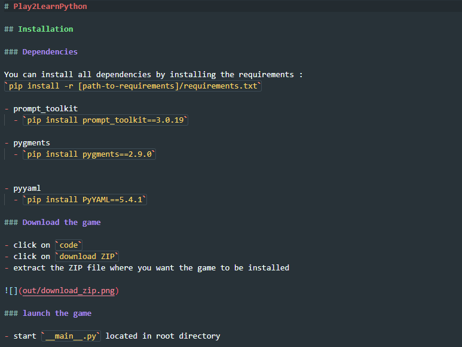
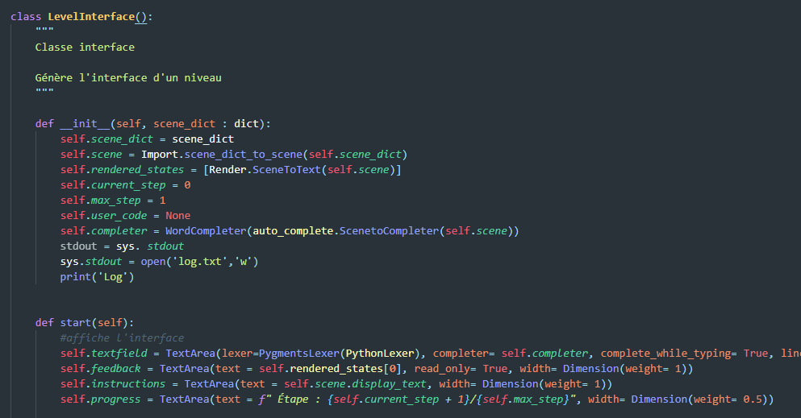
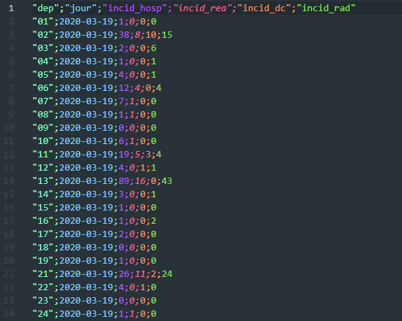

# README | Atom Colorful Material

This is a more colorful version of Atom Material Theme, for better readability and understanding of your code !

Based on Atom Material Theme with several modifications made by hand

Hand modified language syntaxes :

- Python
- Markdown
- CSV
- PlantUML

**Enjoy!**

# Previews

## Markdown Syntax

## Python Syntax

## CSV Syntax

